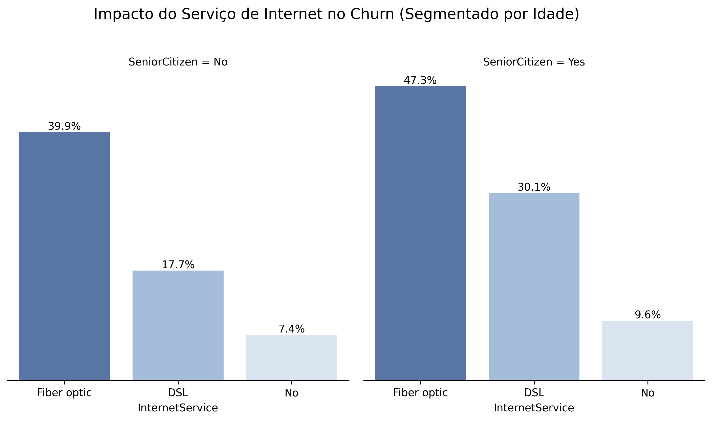
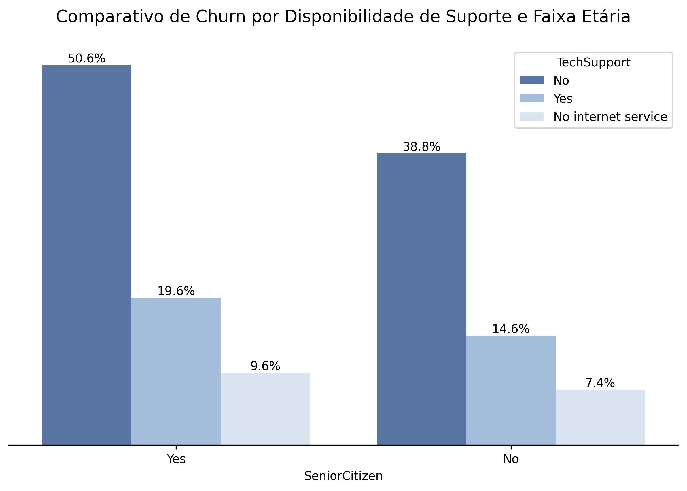
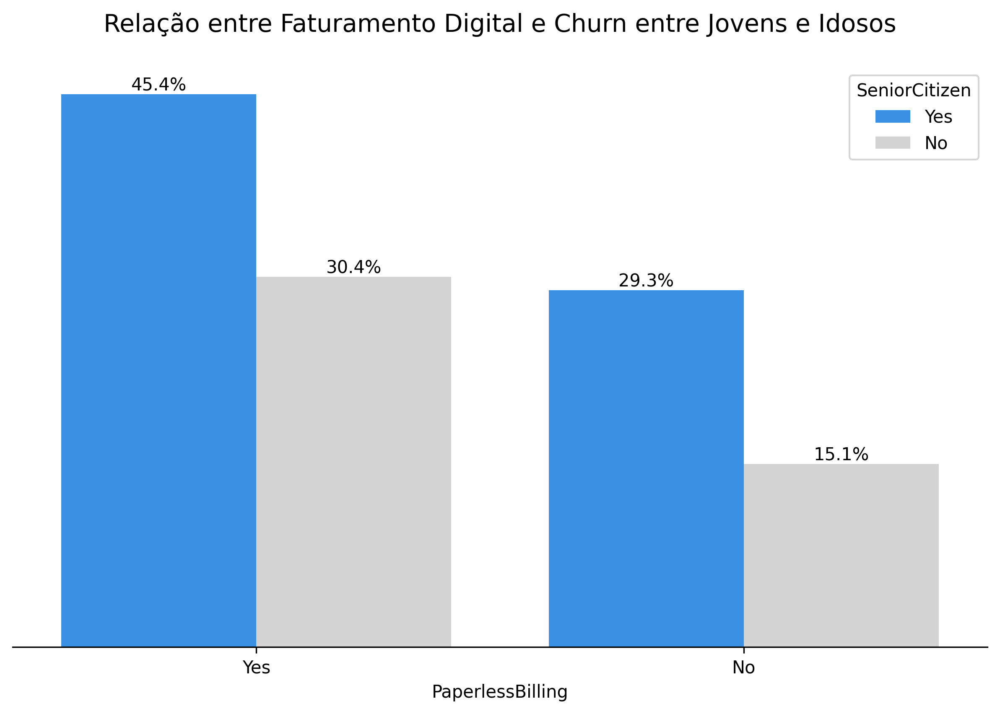
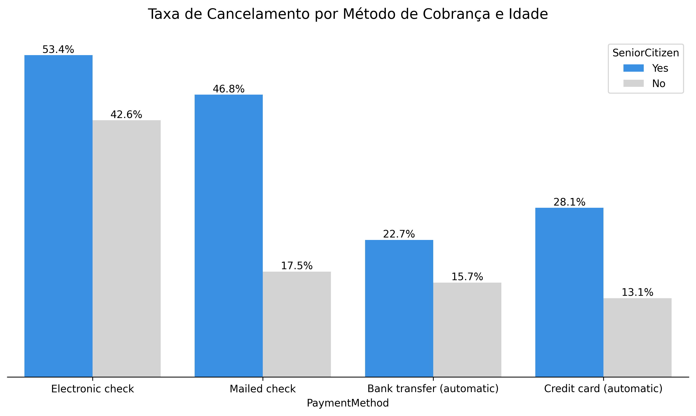
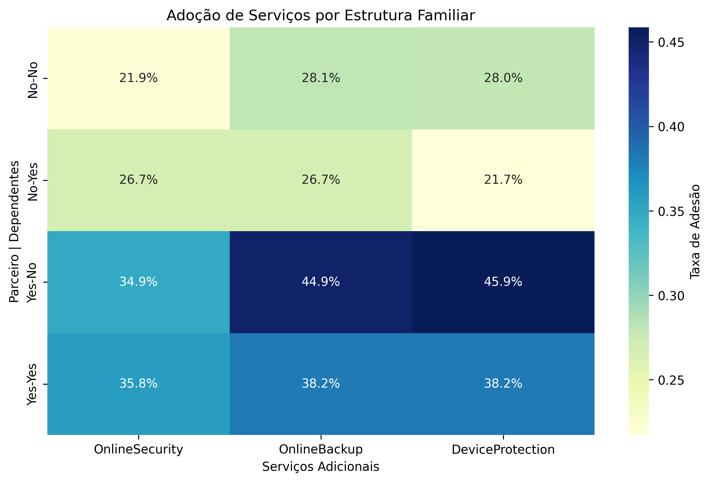

<h1 align="center" style="font-weight: bold;">
  TelecomX_BR 📡 - Estratégias de Retenção baseadas em Comportamento e Dados
</h1>

<p align="center">
  
  
  
  
</p>

<p align="center">
 <a href="#objective">Objetivo</a> • 
 <a href="#problem">O Problema</a> • 
 <a href="#results">Insights de Negócio</a> •
 <a href="#graphics">Gráficos</a> •
 <a href="#strategy">Estratégia Recomendada</a> • 
 <a href="#techs">Tecnologias</a> • 
 <a href="#next">Próximos Passos</a>
 <a href="#structure">Estrutura</a> • 
 <a href="#execute">Como Executar</a> • 
 <a href="#license">Licença</a>
</p>

---
<h2 id="objective"> 📊 Objetivo</h2>
Este projeto realiza uma <strong>Análise Exploratória de Dados (EDA</strong>) com foco na evasão de clientes (<strong>Churn</strong>) da empresa fictícia <strong>TelecomX_BR</strong>.
A proposta é identificar padrões comportamentais e fatores que influenciam o cancelamento de contratos, permitindo a criação de estratégias orientadas por dados para retenção de clientes.

---

<h2 id="problem">🎯 O Problema de Negócio</h2> 

A TelecomX_BR identificou que o cancelamento não é homogêneo. Através desta análise, buscamos responder:
- Por que a **Fibra Óptica** apresenta taxas de evasão tão altas apesar de ser uma tecnologia superior?
- Como a **estrutura familiar** (morar sozinho vs. com dependentes) influencia a retenção?
- Qual o impacto real do **Suporte Técnico** na vida de um cliente idoso?
- A digitalização do faturamento (**Paperless Billing**) é inclusiva ou gera atrito?

---

<h2 id="results"> 📈 Insights de Negócio (O que os dados revelaram)</h2>

### 1. A Vulnerabilidade do Público Sênior 👴
Identificamos que o Churn entre idosos chega a **~50%** quando não há suporte técnico especializado. A falta de uma rede de apoio familiar ("Idosos Solitários") é o principal catalisador de cancelamento.

### 2. O Paradoxo da Fibra Óptica 📡
Embora atraia clientes, a Fibra Óptica gera alto churn em faturas de entrada. No entanto, clientes com **Ticket Médio acima de R$ 95,00** e múltiplos serviços de segurança tendem a ser extremamente fiéis.

### 3. Atrito Digital e Faturamento 📄
A fatura digital gera um churn de **~45%** entre idosos. O documento físico (papel) ainda atua como uma ferramenta crucial de controle e lembrete para este grupo, reduzindo drasticamente a evasão.

### 4. O "Escudo" do Suporte Técnico 🛠️
A adesão ao <strong>suporte técnico</strong> reduz a probabilidade de cancelamento de um idoso de **~51% para ~20%**. O suporte técnico não é apenas um serviço, é o maior motor de retenção da base sênior.

---

<h2 id="graphics">📊 Principais Gráficos</h2>

<p align="center"></p>

<p align="center"></p>

<p align="center"></p>

<p align="center"></p>

<p align="center"></p>

---

<h2 id="strategy"> 🚀 Estratégia Recomendada (Plano de Ação)</h2>

Com base nos dados, o projeto sugere três pilares de atuação:

1. **Estratégia Híbrida de Faturamento:** Manter a fatura em papel para idosos (segurança visual) enquanto se incentiva o pagamento via débito automático (comodidade e retenção passiva).
2. **Pacote "Sênior Seguro":** Criação de planos que incluam Suporte Técnico e Segurança Online, focando na estabilidade e não apenas na velocidade.
3. **Onboarding Humanizado:** Visitas técnicas de cortesia para garantir que clientes solitários dominem a tecnologia instalada, criando uma barreira de saída baseada na confiança.

---

<h2 id="techs"> 🛠️ Tecnologias Utilizadas</h2>

- **Python 3** (Pandas, Matplotlib, Seaborn)
- **Análise Estatística Segmentada**
- **Data Visualization Avançada** (Heatmaps de adesão e Barplots comparativos)

---

<h2 id="next">📌 Próximos Passos</h2>

-  **Feature Engineering:** Criar a variável `is_vulnerable_senior` para o modelo de ML.
-  **Modelagem Preditiva:** Treinar algoritmos de classificação (XGBoost/Random Forest) para prever o Churn proativamente.
-  **A/B Testing:** Validar o impacto da oferta de Suporte Técnico gratuito em grupos de alto risco.

---

<h2 id="structure"> 🧩 Estrutura do Projeto</h2>

```
TelecomX_BR
  ├── TelecomX_BR.ipynb       # Notebook principal com toda a análise
  ├── data-base/              # Database fonte
  ├── images/                 # Principais Gráficos exportados
  ├── LICENSE
  └── README.md
```

---


<h2 id="execute"> 🚀 Como Executar o Projeto</h2>

1. Clone o repositório:

```bash
git clone https://github.com/MiguelLuan/TelecomX_BR.git
```

2. Acesse a pasta do projeto:

```bash
cd TelecomX_BR
```

3. Execute o notebook:

```bash
jupyter notebook TelecomX_BR.ipynb
```

Caso necessário, instale as dependências:

```bash
pip install pandas numpy matplotlib seaborn
```

--- 
## 👨‍💻 Desenvolvedor

| [<br><sub>Miguel Luan</sub>](https://github.com/MiguelLuan) |
| :---: |

---

<h2 id="license"> 📝 Licença </h2>

Este projeto está sob a licença [MIT](https://github.com/MiguelLuan/TelecomX_BR/blob/main/LICENSE).

